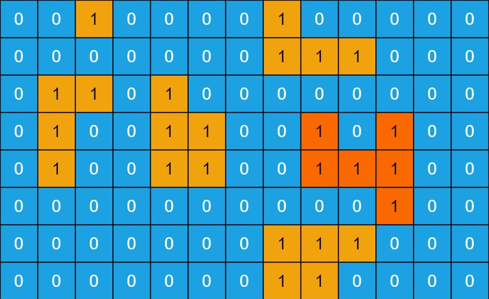

# `islands`

We are given a map of an island archipelago and want to determine the size of the largest island. We begin with a 2-dimensional grid which is represented as a `(list (list @ud))`. Each `@ud` entry is either a `0`, which represents water, or a `1`, which represents land. We consider two land squares to be part of the same island if they are connected horizontally or vertically, **not diagonally**. We assume that the area outside of the map is entirely water.



For example, in the above map, the largest island is the orange colored one of size 6 (not size 11, since it doesn't count as connected to the size 5 island it touches diagonally).

You will write a generator `islands` that accepts a `(list (list @ud))` and returns a `@ud` representing the size of the largest island. It should also crash if given an invalid input, for example, if every grid row (the inner `(list @ud)`) is not the same length, or if any `@ud` is greater than `1`.

Example usage:

```
> +islands ~[~[0 0 1 0 0 0 0 1 0 0 0 0 0] ~[0 0 0 0 0 0 0 1 1 1 0 0 0] ~[0 1 1 0 1 0 0 0 0 0 0 0 0] ~[0 1 0 0 1 1 0 0 1 0 1 0 0] ~[0 1 0 0 1 1 0 0 1 1 1 0 0] ~[0 0 0 0 0 0 0 0 0 0 1 0 0] ~[0 0 0 0 0 0 0 1 1 1 0 0 0] ~[0 0 0 0 0 0 0 1 1 0 0 0 0]]
6
```
This input returns 6 because it represents the same map as above.

```
> islands ~[~[0 1] ~[0 1 0]]
dojo: naked generator failure
```

```
> islands ~[~[0 1] ~[1 2]]
dojo: naked generator failure
```

Two winners will be rewarded. **Fastest Solution** will go to the first person to send in a working solution. **Best Style** will be measured by a variety of factors, including clarity, elegance, following Hoon-ish conventions, being well-commented, and code runtime. For examples, see the challenges and winners from our last competition [[1]](https://docs.urbit.org/language/hoon/examples/abc-blocks) [[2]](https://docs.urbit.org/language/hoon/examples/luhn-number) [[3]](https://docs.urbit.org/language/hoon/examples/water-towers). You can also refer to the [Hoon Style Guide](https://docs.urbit.org/language/hoon/guides/style).


For submission, fill out this [google form](https://forms.gle/C4e7P3XL2ujFtsH69) with your information. See instructions to create the repository below. Remember to make your repo private and add tamlut-modnys as a collaborator.

This challenge opens at 11am ET (8am PT, 5pm Central Europe) on March 2, and will close at the same time on March 9. Good luck!

## Using this Repository

**Please _do not fork this repository directly on GitHub._**  Instead, please use GitHub's "template" function following [the instructions below](#creating-a-repository) to copy this repository and customize it for your project.

If you are working with a fakeship, this is one way to set things up for rapid development:

1. Start a fakeship and `|mount %base`.
2. Clone this repo into the same directory as the fakeship, then copy the contents of `src/` into `zod/base/`.
3. Develop either in `zod/base/` or in this repo folder directly.  It's probably a bit easier to develop in the fakeship and copy back here frequently.

## Testing

This repo provides test cases you can use to verify that your code submission works correctly.

To run the tests, make sure you have mounted and committed the files into the `base` folder of your fake ship. Then from dojo run
```
-test %/tests/islands/hoon
```
This will run several tests, each of which will pass or fail. For debugging help you can inspect the test code to see which ones passed and failed.

To avoid issues, make sure your generator is written in the provided file at `/gen/islands.hoon`

For more info on testing in Hoon, see [this link](https://docs.urbit.org/userspace/apps/guides/unit-tests).

## Creating a Repository

1.  Log in to GitHub.
    (If you do not have an account, you can quickly create one for free.)
    You must be logged in for the remaining steps to work.

2.  On this page, click on the green "Use this template" button (top right)

3.  Select the owner for your new repository.
    (This will probably be you, but may instead be an organization you belong to.)

4.  Choose a name for your copy of the archetype repository.
    We recommend you call it `ha-islands` (no 'template').

5.  Make sure the repository is **private**, leave "Include all branches" unchecked, and click on "Create repository from template". You will be redirected to your new copy of the template respository.

6.  Share the repo with tamlut-modnys on Github as a collaborator.

After this is complete, you can use this repo to handle your competition development and submission. Please note that by submitting a solution, you allow it to be made public under the MIT license.
